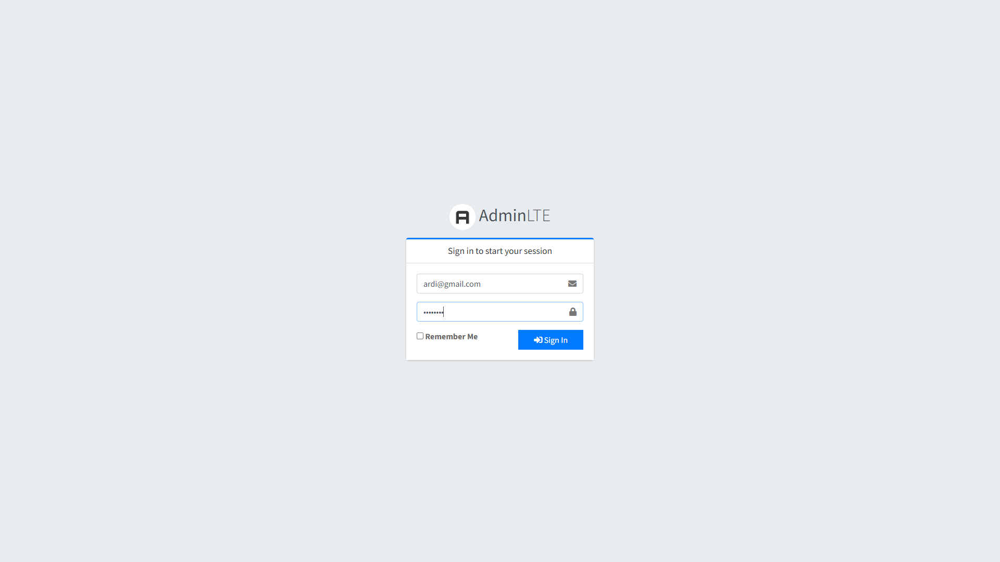
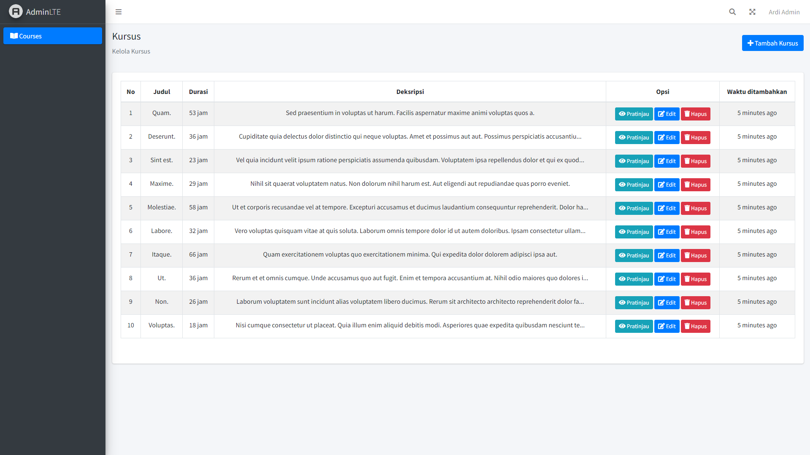
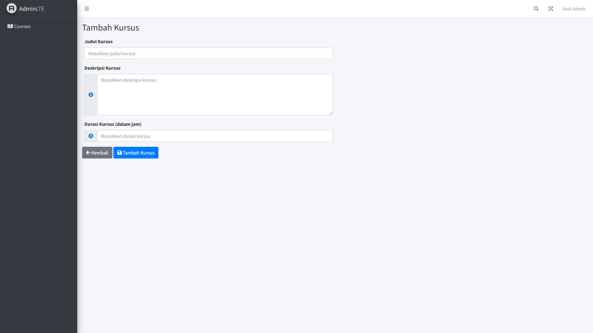
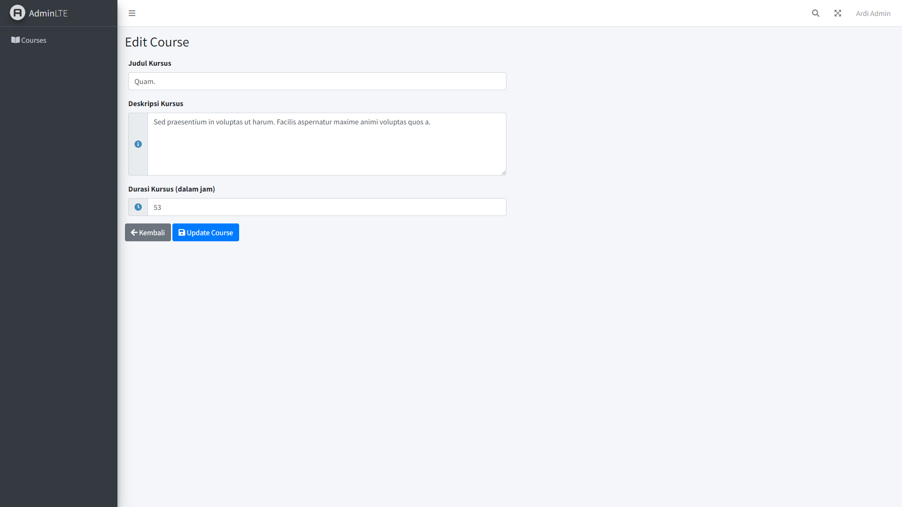
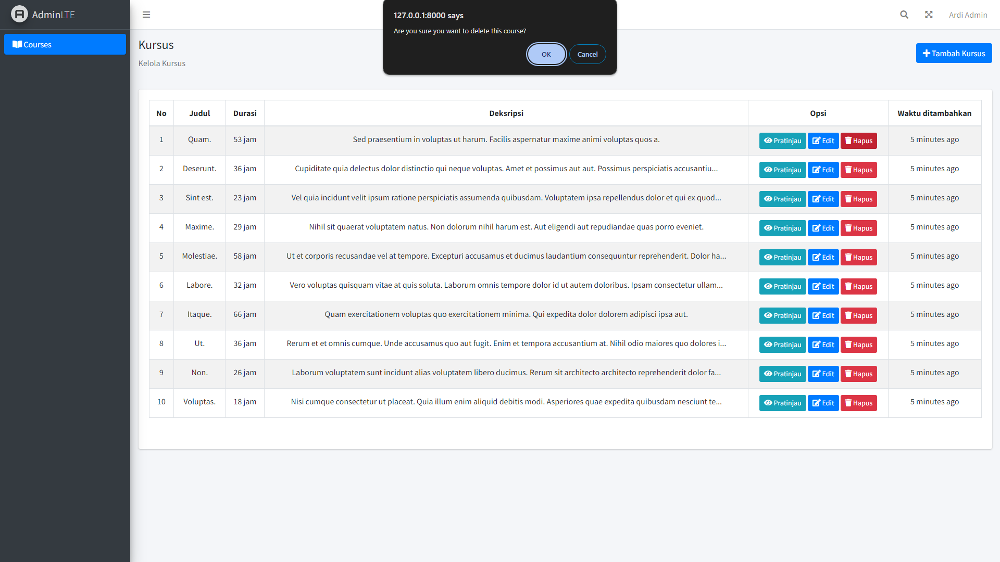
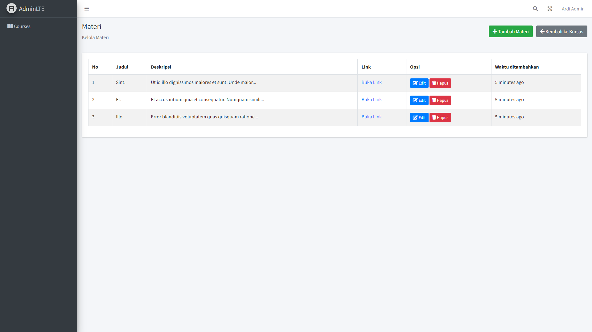
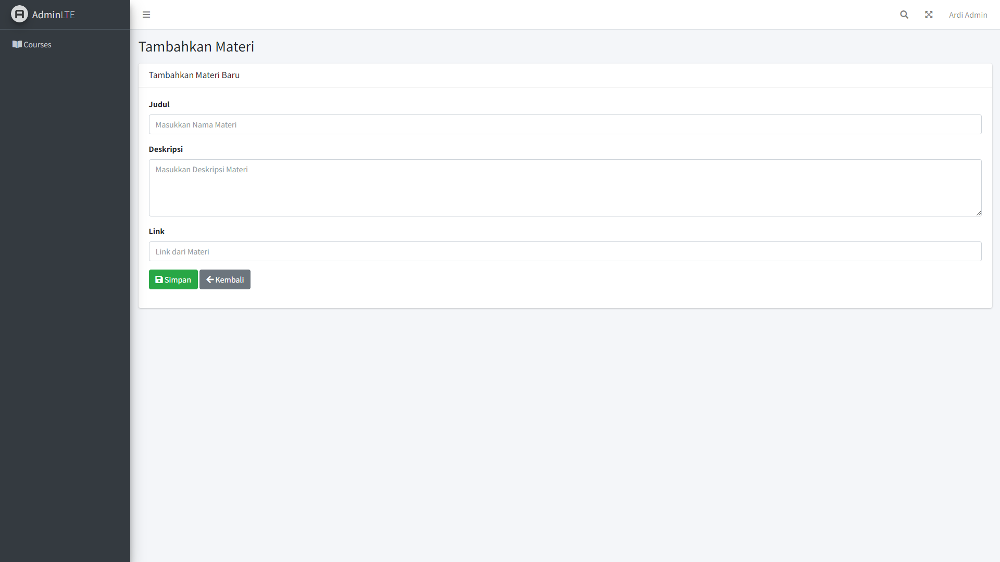
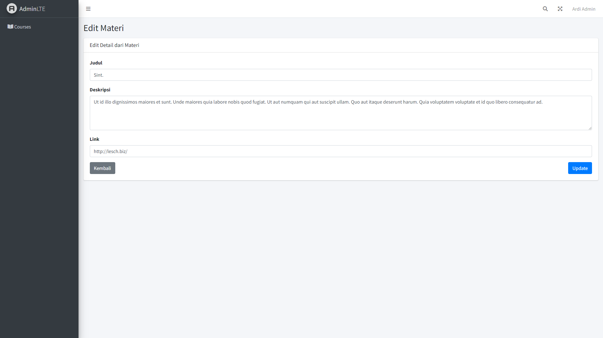

Repository made for test "MSIB 7 - Yayasan Hasnur Centre - Web Developer - Digitaliz" selection test.

[Laravel](https://laravel.com/) 11 & [Laragon](https://laragon.org/) is used for making this project.

## Requirements
- [PHP](https://www.php.net/) >= 8.2
- Webserver of choice *([Apache](https://apache.org) 2.4 used during development)*
- Database of choice *([MySQL](https://www.mysql.com/) 8.0 used during development)*
- [Composer](https://getcomposer.org) >= 2.0

## Installation

1. Clone this repository
    ```
    git https://github.com/ferdyuuya/web-yhc-tesst.git
    ```

2. Initialize the project
    ```
    cd web-yhc-tesst
    composer install 
    ```

3. Configure your environment

    Configure .env file to fit your environment. Use text editor of your choice *([Visual Studio Code](https://code.visualstudio.com/) is used here)* to edit environment.
    ```
    cp .env.example .env
    ```

5. Run the migrations
    ```
    php artisan migrate --seed
    ```

6. Run the app
    ```
    php artisan serve
    ```

## User Login
You can login by using the following credentials.

Email
```
ardi@gmail.com
```
Password
```
password
```

## Screenshots
#### Login

#### Course 




#### Material 



